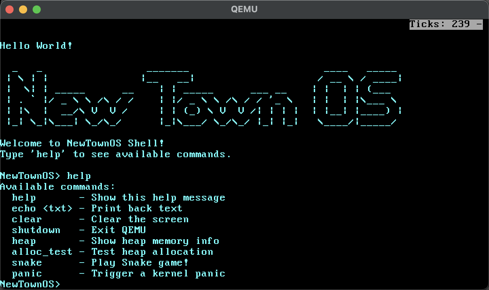
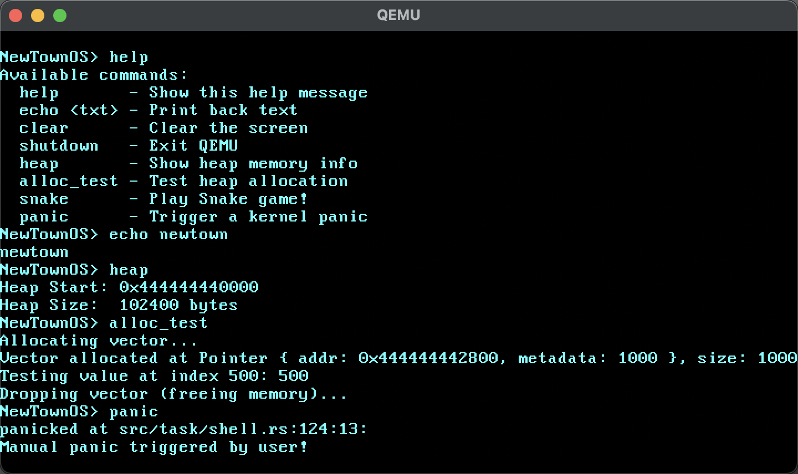
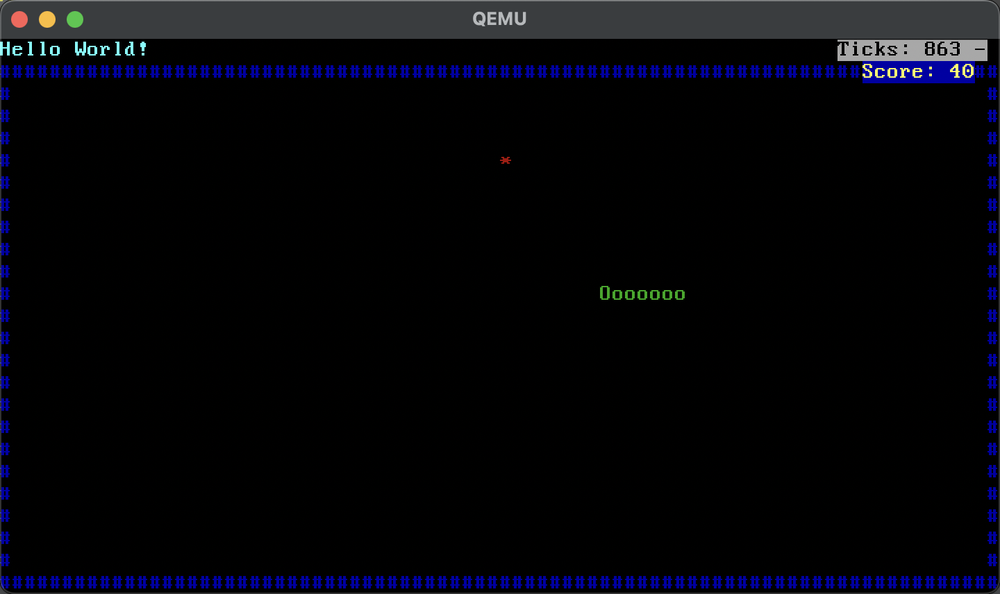

# NewTownOS 🐮



|  |  |
| ------------------------------------------------------------ | ------------------------------------------------------------ |

Welcome to **NewTownOS**! This is a simple, hobby operating system written in **Rust**. It's not Linux, it's not Windows, it's just a toy—but it works!

## What can it do?

Currently, NewTownOS can:

*   **Boot up**: It actually starts on bare metal (well, QEMU).
*   **Show off a Shell**: It has a cool command-line interface with a logo.
*   **Multitask**: You can type commands while a status bar runs in the background. Cooperative multitasking FTW!
*   **Allocate Memory**: It has a real heap allocator. We can create `Vec` and `Box`!
*   **Handle Interrupts**: Keyboard and timer interrupts work perfectly.
*   **Play Snake**: Yes! Type `snake` in the shell to play a fully functional Snake game. 🐍

## How to Run

1.  **Run the setup script** (macOS):
    
    ```bash
    ./setup.sh
    ```
2.  **Launch the OS**:
    ```bash
    cargo run
    ```

That's it! QEMU will pop up and you'll be in NewTownOS.

## Commands

*   `help` - See what you can do.
*   `snake` - Play the built-in game.
*   `clear` - Clean up the mess.
*   `heap` - See memory stats.
*   `shutdown` - Turn it off.
